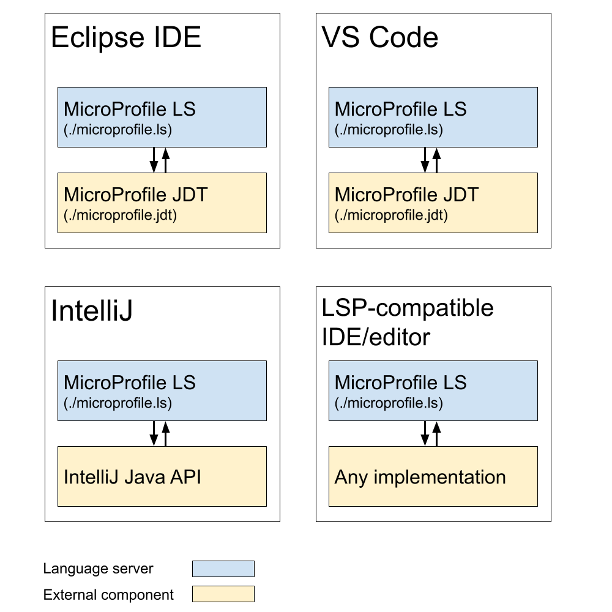

# Eclipse LSP4MP - Language Server for Eclipse MicroProfile

[](https://ci.eclipse.org/lsp4mp/job/lsp4mp/job/master/)
[](https://www.eclipse.org/legal/epl-2.0/)

A language server implementation based on the [Language Server Protocol](https://github.com/Microsoft/language-server-protocol) for [Eclipse MicroProfile](https://microprofile.io/). This Language Server for Eclipse MicroProfile (LSP4MP) provides core language support capabilities (such as code complete, diagnostics, quick fixes) to enable developers to quickly and easily develop applications using MicroProfile APIs.

This project contains:

- [MicroProfile Language Server](./microprofile.ls)
- [MicroProfile JDT LS Extensions](./microprofile.jdt)

You can build all projects at once by running the `buildAll.sh` script (`buildAll.bat` on Windows).

## Features

#### Properties files

In `microprofile-config.properties` files, you will benefit with:

- Completion support for MicroProfile properties
- Hover support for MicroProfile properties
- Definition support for MicroProfile properties
- Format support for MicroProfile properties
- Validation and Quick Fix support for MicroProfile properties
- Outline support (flat or tree view)

#### Java files

In Java files, you will benefit with:

- Completion support for MicroProfile
- Hover support for MicroProfile
- Validation and Quick Fix support for MicroProfile
- Code Lens support for MicroProfile
- Code snippets

## Architecture

The language features provided by the MicroProfile Language Server depend on the user's Java project.
For example, MicroProfile Fault Tolerance features (snippets, validation, completion, etc.) are only provided if the user's
Java project has MicroProfile Fault Tolerance as a depenency.

In order for the MicroProfile Language Server to provide relevant features within a given Java project, the language server
relies on an external component such as MicroProfile JDT (see [MicroProfile JDT LS Extensions](./microprofile.jdt))
to scan/inspect the Java project.

This external component is used to help resolve LSP commands sent from the MicroProfile Language Server.
See [`MicroProfileLanguageClientAPI.java`](https://github.com/eclipse/lsp4mp/blob/master/microprofile.ls/org.eclipse.lsp4mp.ls/src/main/java/org/eclipse/lsp4mp/ls/api/MicroProfileLanguageClientAPI.java).

For example, when the MicroProfile Language Server calls [`MicroProfileProjectInfoProvider#getProjectInfo`](https://github.com/eclipse/lsp4mp/blob/82c4798ac142efeb06499ece053407ef01009d46/microprofile.ls/org.eclipse.lsp4mp.ls/src/main/java/org/eclipse/lsp4mp/ls/api/MicroProfileProjectInfoProvider.java#L35),
the `microprofile/projectInfo` command is handled in the external component with 
[`MicroProfileDelegateCommandHandler#executeCommand`](https://github.com/eclipse/lsp4mp/blob/82c4798ac142efeb06499ece053407ef01009d46/microprofile.jdt/org.eclipse.lsp4mp.jdt.core/src/main/java/org/eclipse/lsp4mp/jdt/internal/core/ls/MicroProfileDelegateCommandHandler.java#L53). 

In the context of Eclipse and VS Code, this external component is managed with [MicroProfile JDT](./microprofile.jdt).
The external component does not necessarily require JDT however, as different implementations can be used instead.
In other words, the MicroProfile Language Server **does not** depend on JDT.
See [Quarkus Tools for IntelliJ](https://github.com/redhat-developer/intellij-quarkus).

The following diagram portrays LSP4MP's integration in various IDEs and editors:



## Getting started

1. Clone this repository
2. Open the folder in your terminal / command line
3. Run ./buildAll.sh (OSX, Linux) or buildAll.bat (Windows)

## Maven coordinates

Here are the Maven coordinates for LSP4MP (replace the `X.Y.Z` version with the [latest release](https://repo.eclipse.org/content/repositories/lsp4mp-releases)):
```xml
<dependency>
  <groupId>org.eclipse.lsp4mp</groupId>
  <artifactId>org.eclipse.lsp4mp.ls</artifactId>
  <version>X>Y>Z</version>
  <classifier>uber</classifier>
  <exclusions>
    <exclusion>
      <groupId>org.eclipse.lsp4j</groupId>
      <artifactId>org.eclipse.lsp4j</artifactId>
    </exclusion>
    <exclusion>
      <groupId>org.eclipse.lsp4j</groupId>
      <artifactId>org.eclipse.lsp4j.jsonrpc</artifactId>
    </exclusion>
  </exclusions>
</dependency>
```

for Gradle:
```
compile(group: 'org.eclipse.lsp4mp', name: 'org.eclipse.lsp4mp', version: 'X.Y.Z', classifier: 'uber')
```

You will have to reference the Maven repository hosting the dependency you need. E.g. for Maven, add this repository to your pom.xml or settings.xml :
```xml
<repository>
  <id>lsp4mp-releases</id>
  <url>https://repo.eclipse.org/content/repositories/lsp4mp-releases/</url>
  <snapshots>
    <enabled>false</enabled>
  </snapshots>
  <releases>
    <enabled>true</enabled>
  </releases>
</repository>
```

And if you want to consume the SNAPSHOT builds instead:
```xml
<repository>
  <id>lsp4mp-snapshots</id>
  <url>https://repo.eclipse.org/content/repositories/lsp4mp-snapshots/</url>
  <releases>
    <enabled>false</enabled>
  </releases>
  <snapshots>
    <enabled>true</enabled>
  </snapshots>
</repository>
```

## Clients

- Visual Studio Code with [vscode-quarkus](https://github.com/redhat-developer/vscode-quarkus)
- IntelliJ with [intellij-quarkus](https://github.com/redhat-developer/intellij-quarkus)
- Eclipse IDE with [jbosstools-quarkus](https://github.com/jbosstools/jbosstools-quarkus)

## Extensions

Both the [MicroProfile JDT LS Extensions](./microprofile.jdt) and [MicroProfile Language Server](./microprofile.ls) can be extended to provide additional functionality. A common extension is to provide [additional snippets via an external JAR](https://github.com/eclipse/lsp4mp/tree/master/microprofile.ls#adding-new-external-snippets).

Example extensions:

- [Quarkus JDT LS Extension](https://github.com/redhat-developer/quarkus-ls/tree/master/quarkus.jdt.ext)
- [Quarkus LS Extension](https://github.com/redhat-developer/quarkus-ls/tree/master/quarkus.ls.ext)

## Feedback

Please report bugs, issues and feature requests by creating a [GitHub Issue](https://github.com/eclipse/lsp4mp/issues)
